## 1. Preparing the data for the workshop
This vignette will use the unprocessed data from the dataset featured in
the publication [Single cell RNA sequencing of stem cell-derived retinal ganglion cells](https://www.nature.com/articles/sdata201813#data-records) 
by [Daniszewski et al. 2018](https://www.ncbi.nlm.nih.gov/pubmed/29437159).

This dataset consists of 1272 human embryonic stem cell-derived retina ganglion 
cells that have been separated into THY1-positive (Sample 1) and THY1-negative 
(Sample 2) cells via flow cytometry. This protein is a marker for pluripotency.

Please note that this data has been batch equalized with subsampling.

## 1.1 Loading the data into R
We will be bypassing the manual preparation of the data for this workshop. If 
you wish to know more about manually loading the data into R, please refer to 
the `ascend` vignettes.

Instead, we will use the `loadCellRanger` command to load the data into R. This
command parses the filtered data generated by Cell Ranger and assumes 
mitochondrial and ribosomal genes will be used as controls. It also parses 
batch information from the cell identifiers assigned by Cell Ranger's
batch aggregation function. Please note that this batch aggregation function
has also normalised the dataset via the subsampling method described 
by [Zheng et al. 2016](https://www.nature.com/articles/ncomms14049).


```r
library(ascend)
# Set path to data
em_set <- loadCellRanger("data/")
```

1.2 Exploring the EMSet
We can review the contents of the EMSet by inputting the variable name of the
EMSet into the console.


```r
em_set
#> [1] "metadata:"
#> class: EMSet
#> dim: 33020 1272
#> metadata:
#> assays: counts
#> rownames: MIR1302-2, FAM138A, OR4F5, RP11-34P13.7, RP11-34P13.8, RP11-34P13.14, RP11-34P13.9, FO538757.2, FO538757.1, AP006222.2 ...
#> rowInfo: gene_id, ensembl_gene_id, control_group
#> rowData: gene_id, qc_ncounts, qc_ncells, qc_meancounts, qc_topgeneranking, qc_pct_total_expression
#> colnames: AAACCTGAGCTGTTCA-1, AAACCTGCAATTCCTT-1, AAACCTGGTCTACCTC-1, AAACCTGTCGGAGCAA-1, AAACGGGAGTCGATAA-1, AAACGGGCACAAGTAA-1, AAAGATGAGGAGCGAG-1, AAAGATGTCAGCTCTC-1, AAAGATGTCTTGACGA-1, AAAGCAATCTATGTGG-1 ...
#> colInfo: cell_barcode, batch
#> colData: cell_barcode, qc_libsize, qc_ngenes, qc_Rb_ncounts, qc_Rb_pct_counts, qc_Mt_ncounts, qc_Mt_pct_counts, qc_nfeaturecounts, qc_pctfeatures
#> reducedDimNames: 
#> spikeNames: 
#> clusterAnalysis: $set_controls
#> $set_controls$Mt
#>  [1] "MT-ND1"  "MT-ND2"  "MT-CO1"  "MT-CO2"  "MT-ATP8" "MT-ATP6" "MT-CO3" 
#>  [8] "MT-ND3"  "MT-ND4L" "MT-ND4"  "MT-ND5"  "MT-ND6"  "MT-CYB" 
#> 
#> $set_controls$Rb
#>   [1] "RPL22"          "RPL11"          "RPS6KA1"        "RPS8"          
#>   [5] "RPL5"           "RPS27"          "RPS6KC1"        "RPS7"          
#>   [9] "RPS27A"         "RPL31"          "RPL37A"         "RPL32"         
#>  [13] "RPL15"          "RPSA"           "RPL14"          "RPL29"         
#>  [17] "RPL24"          "RPL22L1"        "RPL39L"         "RPL35A"        
#>  [21] "RPL9"           "RPL34-AS1"      "RPL34"          "RPS3A"         
#>  [25] "RPL37"          "RPS23"          "RPS14"          "RPL26L1"       
#>  [29] "RPS18"          "RPS10-NUDT3"    "RPS10"          "RPL10A"        
#>  [33] "RPL7L1"         "RPS12"          "RPS6KA2"        "RPS6KA2-AS1"   
#>  [37] "RPS6KA3"        "RPS4X"          "RPS6KA6"        "RPL36A"        
#>  [41] "RPL36A-HNRNPH2" "RPL39"          "RPL10"          "RPS20"         
#>  [45] "RPL7"           "RPL30"          "RPL8"           "RPS6"          
#>  [49] "RPL35"          "RPL12"          "RPL7A"          "RPLP2"         
#>  [53] "RPL27A"         "RPS13"          "RPS6KA4"        "RPS6KB2"       
#>  [57] "RPS3"           "RPS25"          "RPS24"          "RPS26"         
#>  [61] "RPL41"          "RPL6"           "RPLP0"          "RPL21"         
#>  [65] "RPL10L"         "RPS29"          "RPL36AL"        "RPS6KL1"       
#>  [69] "RPS6KA5"        "RPS27L"         "RPL4"           "RPLP1"         
#>  [73] "RPS17"          "RPL3L"          "RPS2"           "RPS15A"        
#>  [77] "RPL13"          "RPL26"          "RPL23A"         "RPL23"         
#>  [81] "RPL19"          "RPL27"          "RPS6KB1"        "RPL38"         
#>  [85] "RPL17-C18orf32" "RPL17"          "RPS21"          "RPS15"         
#>  [89] "RPL36"          "RPS28"          "RPL18A"         "RPS16"         
#>  [93] "RPS19"          "RPL18"          "RPL13A"         "RPS11"         
#>  [97] "RPS9"           "RPL28"          "RPS5"           "RPS4Y1"        
#> [101] "RPS4Y2"         "RPL3"           "RPS19BP1"      
#> 
#> 
#> $controls
#> [1] TRUE
```

The summary shows how many genes are in the EMSet, what genes were set as 
controls and what is kept in the various slots of the EMSet. You may recognise
some of the slot names from somewhere - this is because this version of the
EMSet has inherited from the [SingleCellExperiment](https://bioconductor.org/packages/release/bioc/vignettes/SingleCellExperiment/inst/doc/intro.html#the-singlecellexperiment-class) superclass.

The EMSet differs from the SingleCellExperiment class in which it contains 
seperate slots for cell and gene-related metadata and additional slots for
cluster analysis and log information. Also, the EMSet generates a set of
quality control metrics based on the count matrix upon creation, and will
update the metrics everytime this matrix is changed.

We can review the cell information that is stored in the colInfo slot as follows:


```r
# Cell-related metadata
print("Using colInfo...")
#> [1] "Using colInfo..."
colInfo(em_set)
#> DataFrame with 1272 rows and 2 columns
#>                          cell_barcode     batch
#>                           <character> <numeric>
#> AAACCTGAGCTGTTCA-1 AAACCTGAGCTGTTCA-1         1
#> AAACCTGCAATTCCTT-1 AAACCTGCAATTCCTT-1         1
#> AAACCTGGTCTACCTC-1 AAACCTGGTCTACCTC-1         1
#> AAACCTGTCGGAGCAA-1 AAACCTGTCGGAGCAA-1         1
#> AAACGGGAGTCGATAA-1 AAACGGGAGTCGATAA-1         1
#> ...                               ...       ...
#> TTTATGCCACAGTCGC-2 TTTATGCCACAGTCGC-2         2
#> TTTGCGCGTTGACGTT-2 TTTGCGCGTTGACGTT-2         2
#> TTTGCGCGTTGTCTTT-2 TTTGCGCGTTGTCTTT-2         2
#> TTTGTCAGTGAGTGAC-2 TTTGTCAGTGAGTGAC-2         2
#> TTTGTCATCTTCATGT-2 TTTGTCATCTTCATGT-2         2

# Cell-related metrics
print("Using colData...")
#> [1] "Using colData..."
colData(em_set)
#> DataFrame with 1272 rows and 9 columns
#>                          cell_barcode qc_libsize qc_ngenes qc_Rb_ncounts
#>                           <character>  <numeric> <numeric>     <numeric>
#> AAACCTGAGCTGTTCA-1 AAACCTGAGCTGTTCA-1      13074      3889          3626
#> AAACCTGCAATTCCTT-1 AAACCTGCAATTCCTT-1       7957      3071          1891
#> AAACCTGGTCTACCTC-1 AAACCTGGTCTACCTC-1      18777      4726          5421
#> AAACCTGTCGGAGCAA-1 AAACCTGTCGGAGCAA-1       8320      2368          3299
#> AAACGGGAGTCGATAA-1 AAACGGGAGTCGATAA-1      11085      3415          3277
#> ...                               ...        ...       ...           ...
#> TTTATGCCACAGTCGC-2 TTTATGCCACAGTCGC-2       8365      3173          1521
#> TTTGCGCGTTGACGTT-2 TTTGCGCGTTGACGTT-2      21582      4428          6426
#> TTTGCGCGTTGTCTTT-2 TTTGCGCGTTGTCTTT-2     111166      9996         36060
#> TTTGTCAGTGAGTGAC-2 TTTGTCAGTGAGTGAC-2      16552      4531          3381
#> TTTGTCATCTTCATGT-2 TTTGTCATCTTCATGT-2      15640      3569          6474
#>                    qc_Rb_pct_counts qc_Mt_ncounts qc_Mt_pct_counts
#>                           <numeric>     <numeric>        <numeric>
#> AAACCTGAGCTGTTCA-1 27.7344347560043           213 1.62918770078017
#> AAACCTGCAATTCCTT-1 23.7652381550836           278 3.49377906246073
#> AAACCTGGTCTACCTC-1 28.8704265857166           677 3.60547478297918
#> AAACCTGTCGGAGCAA-1 39.6514423076923           258 3.10096153846154
#> AAACGGGAGTCGATAA-1 29.5624718087506           425  3.8340099233198
#> ...                             ...           ...              ...
#> TTTATGCCACAGTCGC-2 18.1829049611476           155 1.85295875672445
#> TTTGCGCGTTGACGTT-2 29.7748123436197           781 3.61875637104995
#> TTTGCGCGTTGTCTTT-2 32.4379756400338          3387 3.04679488332764
#> TTTGTCAGTGAGTGAC-2 20.4265345577574           655 3.95722571290478
#> TTTGTCATCTTCATGT-2 41.3938618925831           265 1.69437340153453
#>                    qc_nfeaturecounts   qc_pctfeatures
#>                            <numeric>        <numeric>
#> AAACCTGAGCTGTTCA-1              9235 70.6363775432155
#> AAACCTGCAATTCCTT-1              5788 72.7409827824557
#> AAACCTGGTCTACCTC-1             12679 67.5240986313043
#> AAACCTGTCGGAGCAA-1              4763 57.2475961538462
#> AAACGGGAGTCGATAA-1              7383 66.6035182679296
#> ...                              ...              ...
#> TTTATGCCACAGTCGC-2              6689 79.9641362821279
#> TTTGCGCGTTGACGTT-2             14375 66.6064312853304
#> TTTGCGCGTTGTCTTT-2             71719 64.5152294766385
#> TTTGTCAGTGAGTGAC-2             12516 75.6162397293378
#> TTTGTCATCTTCATGT-2              8901 56.9117647058823

# Gene-related metadata
print("Using rowInfo...")
#> [1] "Using rowInfo..."
rowInfo(em_set)
#> DataFrame with 33020 rows and 3 columns
#>                   gene_id ensembl_gene_id control_group
#>               <character>     <character>   <character>
#> MIR1302-2       MIR1302-2 ENSG00000243485            NA
#> FAM138A           FAM138A ENSG00000237613            NA
#> OR4F5               OR4F5 ENSG00000186092            NA
#> RP11-34P13.7 RP11-34P13.7 ENSG00000238009            NA
#> RP11-34P13.8 RP11-34P13.8 ENSG00000239945            NA
#> ...                   ...             ...           ...
#> AC233755.2     AC233755.2 ENSG00000277856            NA
#> AC233755.1     AC233755.1 ENSG00000275063            NA
#> AC240274.1     AC240274.1 ENSG00000271254            NA
#> AC213203.1     AC213203.1 ENSG00000277475            NA
#> FAM231C.1       FAM231C.1 ENSG00000268674            NA

# Gene-related metrics
print("Using rowData...")
#> [1] "Using rowData..."
rowData(em_set)
#> DataFrame with 33020 rows and 6 columns
#>                   gene_id qc_ncounts qc_ncells        qc_meancounts
#>               <character>  <numeric> <numeric>            <numeric>
#> MIR1302-2       MIR1302-2          0         0                    0
#> FAM138A           FAM138A          0         0                    0
#> OR4F5               OR4F5          0         0                    0
#> RP11-34P13.7 RP11-34P13.7          4         4  0.00314465408805031
#> RP11-34P13.8 RP11-34P13.8          1         1 0.000786163522012579
#> ...                   ...        ...       ...                  ...
#> AC233755.2     AC233755.2          0         0                    0
#> AC233755.1     AC233755.1          0         0                    0
#> AC240274.1     AC240274.1         97        94   0.0762578616352201
#> AC213203.1     AC213203.1          0         0                    0
#> FAM231C.1       FAM231C.1          0         0                    0
#>              qc_topgeneranking qc_pct_total_expression
#>                      <integer>               <numeric>
#> MIR1302-2                22278                       0
#> FAM138A                  22279                       0
#> OR4F5                    22280                       0
#> RP11-34P13.7             18061    1.84549157020974e-05
#> RP11-34P13.8             20358    4.61372892552436e-06
#> ...                        ...                     ...
#> AC233755.2               33017                       0
#> AC233755.1               33018                       0
#> AC240274.1               11394    0.000447531705775863
#> AC213203.1               33019                       0
#> FAM231C.1                33020                       0
```

## 2. Quality Control and Filtering
This workflow is similar to other scRNA-seq filtering workflows available
through packages such as `seurat` and `scater`. You can read more about quality 
control through these links:

1. [Analyzing single-cell RNA-seq data containing UMI counts](https://bioconductor.org/packages/release/workflows/vignettes/simpleSingleCell/inst/doc/work-2-umis.html) by Lun, McCarthy & Marioni 2018
2. [Cleaning the Expression Matrix](https://hemberg-lab.github.io/scRNA.seq.course/cleaning-the-expression-matrix.html#exprs-qc) by Kiselex, Andrews, McCarthy, Buttner & Hemberg 2018

### 2.1 Assessing quality of the dataset
First, we will have a look at the quality of the dataset. Some quality control
metrics were generated when the EMSet was created; they are stored in the
`rowData` (metrics for genes) and `colData` (metrics for cells) slots. We can
visualise these values with quality control plots.

We can generate all the plots we will need for this step with with the
plotGeneralQC function.


```r
qc_plots <- plotGeneralQC(em_set)
```


The two plots below represent metrics related to the total number of UMIs 
mapped to a cell.

The first plot is a barplot that depicts the library size of each cell and is
coloured by the batch. This plot lets us quickly review the distribution of
library sizes and if there are any significant batch effects in the dataset.

The second plot is a histogram of library sizes, with library size on the x-axis
and number of cells with the library size on the y-axis. Please note that this 
dataset comprises of cells that have already been filtered from the background
based on a minimum threshold value for the number of UMIs present in the cell.
There are some cells with significantly larger numbers of UMIs - they may be
doublets where more than one cell ended up in a droplet. We will need to 
remove these cells.


```r
library(gridExtra)
#> 
#> Attaching package: 'gridExtra'
#> The following object is masked from 'package:Biobase':
#> 
#>     combine
#> The following object is masked from 'package:BiocGenerics':
#> 
#>     combine
#> The following object is masked from 'package:dplyr':
#> 
#>     combine
grid.arrange(qc_plots$libsize_barplot, qc_plots$libsize_histogram, ncol = 1)
```

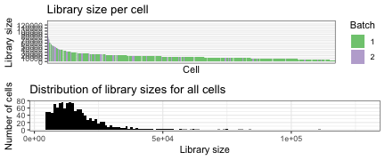

We also want to review the number of genes being expressed in each cell, and
what proportion of UMIs are mapped to top gene expressors. The first plot below
represents the number of cells expressing a number of genes. The number of
expressed genes will differ based on the cell type and other factors such 
as cell cycle phase.

The second plot represents the proportion of genes mapped to the top 500 most
expressed genes (y-axis) per sample, with each point representing the percentage
of expression contributed by the 100 most-expressed genes. 


```r
grid.arrange(qc_plots$ngenes_hist, qc_plots$topgenes_violin, ncol = 1)
```

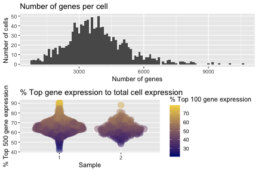

Some cells appear to be dominated by the expression of a small subset of genes. 
These genes may be mitochondrial and ribosomal genes. 

The plots below show the proportion of mitochondrial and ribosomal gene
expression to total expression. Some cells have a higher proportion of ribosomal
gene expression that can indicate they are of low quality, and should be 
removed from the dataset.


```r
grid.arrange(qc_plots$control_hists$Mt, qc_plots$control_hists$Rb, ncol = 2)
```

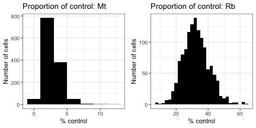


```r
grid.arrange(qc_plots$control_violins$Mt, qc_plots$control_violins$Rb, ncol = 1)
```

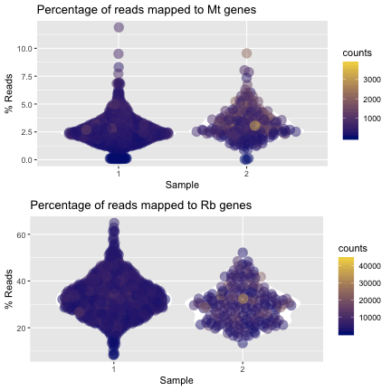

### 2.2 Batch normalisation
Before we start filtering, we need to normalise the counts between the two 
batches to account for technical variations. The read counts have already been 
normalised already via the Cell Ranger pipeline's subsampling method. 
This batch normalisation method scales UMI counts between batches.


```r
em_set <- normaliseBatches(em_set)
#> [1] "Calculating size factors..."
#> [1] "Scaling counts..."
#> [1] "Storing data in EMSet..."
#> [1] "Re-calculating QC metrics..."
#> [1] "Batch normalisation complete! Returning object..."
```

### 2.3 Filtering low quality cells from the dataset
There are three filtering functions in the `ascend` package. 

1. `filterByOutliers` removes outliers in terms of library size and control
expression based on median absolute deviation (MAD).
2. `filterByControl` removes cells where genes in the specified control group
account for more than the specified percentage of expression.
3. `filterLowAbundanceGenes` removes genes that are expressed in less than
the specified percentage of cells.


```r
# Filter library size and controls by MAD
filtered_set <- filterByOutliers(em_set, 
                                 cell.threshold = 3, 
                                 control.threshold = 3)
#> [1] "Identifying outliers..."

# Filter out cells based on proportion of control expression
filtered_set <- filterByControl(filtered_set, control = "Mt", pct.threshold = 20)
filtered_set <- filterByControl(filtered_set, control = "Rb", pct.threshold = 50)
filtered_set <- filterLowAbundanceGenes(filtered_set, pct.threshold = 1)
```

We can review which cells and genes were removed from the dataset by reviewing
the progress log. As thousands of low abundance genes were removed, we'll look
at the summary of the log.


```r
str(progressLog(filtered_set))
#> List of 7
#>  $ set_controls            :List of 2
#>   ..$ Mt: chr [1:13] "MT-ND1" "MT-ND2" "MT-CO1" "MT-CO2" ...
#>   ..$ Rb: chr [1:103] "RPL22" "RPL11" "RPS6KA1" "RPS8" ...
#>  $ controls                : logi TRUE
#>  $ normaliseBatches        : logi TRUE
#>  $ filterByOutliers        :List of 4
#>   ..$ CellsFilteredByLibSize      : chr(0) 
#>   ..$ CellsFilteredByLowExpression: chr(0) 
#>   ..$ CellsFilteredByMt           : chr [1:36] "AAAGTAGGTTAGTGGG-2" "AACACGTAGTGGGTTG-1" "AACGTTGTCACGAAGG-1" "AAGACCTGTCTGGAGA-1" ...
#>   ..$ CellsFilteredByRb           : chr [1:9] "AACTGGTTCATAAAGG-1" "ACGATACGTCACACGC-1" "AGCCTAACAGTAACGG-1" "AGTCTTTTCACCACCT-1" ...
#>  $ FilteringLog            :'data.frame':	1 obs. of  7 variables:
#>   ..$ CellsFilteredByLibSize      : int 0
#>   ..$ CellsFilteredByLowExpression: int 0
#>   ..$ CellsFilteredByMt           : int 36
#>   ..$ CellsFilteredByRb           : int 9
#>   ..$ CellsFilteredByMtPct        : int 0
#>   ..$ CellsFilteredByRbPct        : int 30
#>   ..$ FilteredLowAbundanceGenes   : int 17330
#>  $ filterByControl         :List of 2
#>   ..$ Mt: list()
#>   ..$ Rb: chr [1:30] "AACTGGTTCATAAAGG-1" "AAGACCTAGACAATAC-1" "ACCAGTATCGGTTCGG-1" "ACGATACGTCACACGC-1" ...
#>  $ RemovedLowAbundanceGenes: chr [1:17330] "A1CF" "A2ML1" "A2ML1-AS1" "A2ML1-AS2" ...
```

We can also review the impact of QC on the dataset by regenerating the QC plots.


```r
filtered_qc_plots <- plotGeneralQC(filtered_set)
```


```r
grid.arrange(filtered_qc_plots$libsize_histogram, filtered_qc_plots$ngenes_hist, 
             filtered_qc_plots$control_hists$Mt, filtered_qc_plots$control_hists$Rb, 
             filtered_qc_plots$control_violins$Mt, filtered_qc_plots$control_violins$Rb,
             ncol = 2)
```

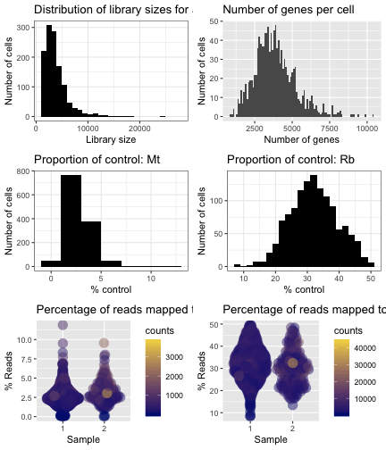

### 3. Cell-cell normalisation
`ascend` offers a normalisation method based on Relative Log Expression. This 
is the method used by DESeq to normalise counts, but has been adapated for 
zero-inflated data.

In this method, each cell is considered as one library and assumes that most 
genes are not differentially expressed. It uses gene expression values higher 
than 0 to calculate the geometric means of a gene. The geometric mean is the
mean of the expression of the gene across all cells (for cells where the gene is 
detected). Each gene has one geometric mean value for all cell. For each cell,
the gene expression values are divided by the geometric means to get one 
normalisation factor for a gene in that cell. The median of all the 
normalisation factors for all genes in that cell is the normalisation factor for 
the cell. 

Post RLE normalisation, a gene with 0 expression still has 0 expression. A gene 
with expression higher than 0 will have an expression value equal the raw expression 
divided by the calculated normalization factor for the cell.


```r
norm_set <- normaliseByRLE(filtered_set)
#> [1] "Calculating geometric means..."
#> [1] "Calculating normalisation factor..."
#> [1] "Scaling counts..."
#> [1] "Storing normalised counts..."
```

Original counts are retained in the EMSet. Normalised counts and log-transformed
normalised counts are stored in the EMSet as well, accessible via the 
`normcounts` and `logcounts` accessors from the SingleCellExperiment class.


```r
# Raw counts
counts(norm_set)[1:5,1:5]
#>               AAACCTGAGCTGTTCA-1 AAACCTGCAATTCCTT-1 AAACCTGGTCTACCTC-1
#> FO538757.1             0.0000000          0.2222222          0.0000000
#> AP006222.2             0.2222222          0.0000000          0.2222222
#> RP11-206L10.9          0.0000000          0.0000000          0.0000000
#> LINC00115              0.0000000          0.0000000          0.0000000
#> FAM41C                 0.0000000          0.0000000          0.0000000
#>               AAACCTGTCGGAGCAA-1 AAACGGGAGTCGATAA-1
#> FO538757.1                     0          0.2222222
#> AP006222.2                     0          0.0000000
#> RP11-206L10.9                  0          0.0000000
#> LINC00115                      0          0.0000000
#> FAM41C                         0          0.0000000

# Normalised counts
normcounts(norm_set)[1:5,1:5]
#>               AAACCTGAGCTGTTCA-1 AAACCTGCAATTCCTT-1 AAACCTGGTCTACCTC-1
#> FO538757.1             0.0000000           0.244853          0.0000000
#> AP006222.2             0.2798369           0.000000          0.2248043
#> RP11-206L10.9          0.0000000           0.000000          0.0000000
#> LINC00115              0.0000000           0.000000          0.0000000
#> FAM41C                 0.0000000           0.000000          0.0000000
#>               AAACCTGTCGGAGCAA-1 AAACGGGAGTCGATAA-1
#> FO538757.1                     0          0.3444377
#> AP006222.2                     0          0.0000000
#> RP11-206L10.9                  0          0.0000000
#> LINC00115                      0          0.0000000
#> FAM41C                         0          0.0000000

# Log2(counts) + 1
logcounts(norm_set)[1:5, 1:5]
#>               AAACCTGAGCTGTTCA-1 AAACCTGCAATTCCTT-1 AAACCTGGTCTACCTC-1
#> FO538757.1               0.00000          0.3159754          0.0000000
#> AP006222.2               0.35596          0.0000000          0.2925513
#> RP11-206L10.9            0.00000          0.0000000          0.0000000
#> LINC00115                0.00000          0.0000000          0.0000000
#> FAM41C                   0.00000          0.0000000          0.0000000
#>               AAACCTGTCGGAGCAA-1 AAACGGGAGTCGATAA-1
#> FO538757.1                     0          0.4270029
#> AP006222.2                     0          0.0000000
#> RP11-206L10.9                  0          0.0000000
#> LINC00115                      0          0.0000000
#> FAM41C                         0          0.0000000
```

We can generate some plots to review the impact of normalisation on the dataset.


```r
norm_qc <- plotNormQC(norm_set)
#> [1] "Plotting GAPDH expression..."
#> [1] "Plotting MALAT1 expression..."
#> [1] "Plotting gene expression box plots..."
```

This set of plots depict the library sizes of cells prior to and after 
RLE normalisation.


```r
grid.arrange(norm_qc$libsize_histograms$count, 
             norm_qc$libsize_histograms$normcount, ncol = 1)
```

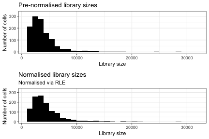

The following plots depict the impact of RLE normalisation on GAPDH counts.


```r
grid.arrange(norm_qc$sampled_genes$GAPDH$counts,
             norm_qc$sampled_genes$GAPDH$normcounts, ncol = 1)
```

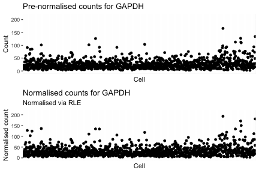

The following plots depict the impact of RLE normalisation on MALAT1 counts.


```r
grid.arrange(norm_qc$sampled_genes$MALAT1$counts,
             norm_qc$sampled_genes$MALAT1$normcounts, ncol = 1)
```

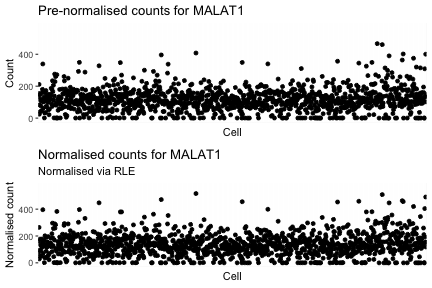

The following plots depict the impact of RLE normalisation on all gene counts
from 100 randomly-selected cells.


```r
grid.arrange(norm_qc$sampled_cell_gene_expression$counts,
             norm_qc$sampled_cell_gene_expression$normcounts, ncol = 1)
```

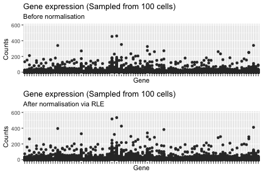

We have also included a wrapper for `scran`'s deconvolution method.

## 4. Control removal
We can review the top expressors by examining the top gene expression boxplot.


```r
filtered_qc_plots$topgenes_boxplot
```

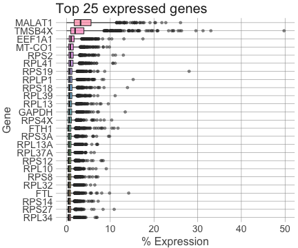

As mitochondrial and ribosomal genes still dominate top expression after filtering,
we should remove them from the dataset so we can observe genes of interest.


```r
# Exclude mitochondrial and ribosomal genes
norm_set <- excludeControl(norm_set, control = c("Mt", "Rb"))
```


```r
print(plotTopGenesBoxplot(norm_set, n = 20))
```

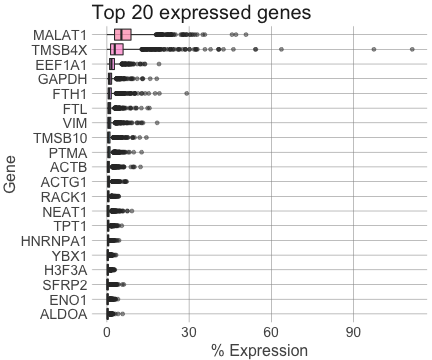

## 5. Dimensionality reduction
Dimensionality reduction is used to reduce the number of variables we have to
assess which will reduce noise and speed up subesequent analyses. It is also 
used to visualise the data in 2 or 3 dimensional space.

We will transform our data with Principal Component Analysis (PCA).


```r
pca_set <- runPCA(norm_set, ngenes = 1500, scaling = TRUE)
#> [1] "Computing PCA values..."
#> [1] "PCA complete! Loading PCA into EMSet..."
reducedDim(pca_set, "PCA")[1:5,1:5]
#>                          PC1        PC2        PC3       PC4        PC5
#> AAACCTGAGCTGTTCA-1  6.204334 -1.6281152  2.8726863 -4.036877  2.2084668
#> AAACCTGCAATTCCTT-1 19.811011  0.7822773  0.5806704  2.406687 -0.9392580
#> AAACCTGGTCTACCTC-1 -3.731646  2.4602419 -2.8501564  7.405031 -1.1189194
#> AAACCTGTCGGAGCAA-1 18.478563 -0.0184362  1.3187185  1.221498 -1.3488342
#> AAACGGGAGTCGATAA-1 12.726645 -0.1389756 -0.5043133  3.052412  0.2543215
```

We can observe how much variance each principal component contributes to a 
dataset using a scree plot. The first PC will contribute the most variance
to a dataset, but the number of PCs that do contribute variance will differ.


```r
plotPCAVariance(pca_set, n = 50)
```

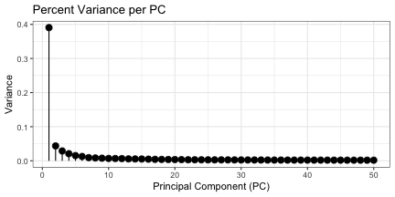

As previously mentioned, these values can also be used to represent the data
in two dimensions.


```r
plotPCA(pca_set, PCX = 1, PCY = 2, group = "batch")
```

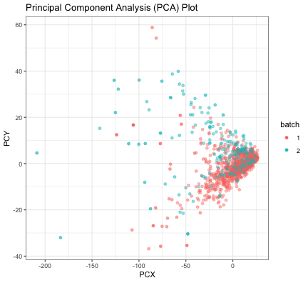

## 6. Clustering
### 6.1 Using runCORE
The `runCORE` function generates a distance matrix based on the input and from 
this, builds a dendrogram. This dendrogram is then cut with the `dynamicTreeCut` 
algorithm to select clusters from the dendrogram based on the shape and size of 
the branches. The cut is then repeated over a range of heights ranging from 0
to 1. The clusters generated by the most robust height - defined as the point 
where cluster numbers stabilise, is chosen as the optimal clustering result.


```r
clustered_set <- runCORE(pca_set, 
                         conservative = FALSE, 
                         remove_outlier = TRUE,
                         nres = 40)
#> [1] "Calculating distance matrix..."
#> [1] "Generating hclust object..."
#> [1] "Using dynamicTreeCut to generate reference set of clusters..."
#> Found more than one class "dist" in cache; using the first, from namespace 'BiocGenerics'
#> Also defined by 'spam'
#> Found more than one class "dist" in cache; using the first, from namespace 'BiocGenerics'
#> Also defined by 'spam'
#> Found more than one class "dist" in cache; using the first, from namespace 'BiocGenerics'
#> Also defined by 'spam'
#> [1] "Checking if outliers are present..."
#> [1] "Generating clusters by running dynamicTreeCut at different heights..."
#> [1] "Calculating rand indices..."
#> [1] "Calculating stability values..."
#> [1] "Aggregating data..."
#> [1] "Finding optimal number of clusters..."
#> [1] "Optimal number of clusters found! Returning output..."
```

`runCORE` generates a series of clustering-related objects, that can be
accessed as follows:


```r
cluster_analysis <- clusterAnalysis(clustered_set)

# Number of clusters
cluster_analysis$nClusters
#> [1] 3

# Rand Index values
cluster_analysis$keyStats
#>    Height Stability RandIndex ConsecutiveRI ClusterCount
#> 1   0.025     0.225 1.0000000     1.0000000            7
#> 2    0.05     0.225 1.0000000     1.0000000            7
#> 3   0.075     0.225 1.0000000     1.0000000            7
#> 4     0.1     0.225 1.0000000     1.0000000            7
#> 5   0.125     0.225 1.0000000     1.0000000            7
#> 6    0.15     0.225 1.0000000     1.0000000            7
#> 7   0.175     0.225 1.0000000     1.0000000            7
#> 8     0.2     0.225 1.0000000     1.0000000            7
#> 9   0.225     0.225 1.0000000     1.0000000            7
#> 10   0.25     0.025 0.9463405     0.9463405            6
#> 11  0.275     0.025 0.9463405     1.0000000            6
#> 12    0.3     0.025 0.5185170     0.5608300            5
#> 13  0.325     0.025 0.5185170     1.0000000            5
#> 14   0.35     0.025 0.5154509     0.9960010            4
#> 15  0.375     0.075 0.5154509     1.0000000            4
#> 16    0.4     0.075 0.5154509     1.0000000            4
#> 17  0.425     0.075 0.5154509     1.0000000            4
#> 18   0.45     0.025 0.4669202     0.9345679            3
#> 19  0.475     0.200 0.4669202     1.0000000            3
#> 20    0.5     0.200 0.4669202     1.0000000            3
#> 21  0.525     0.200 0.4669202     1.0000000            3
#> 22   0.55     0.200 0.4669202     1.0000000            3
#> 23  0.575     0.200 0.4669202     1.0000000            3
#> 24    0.6     0.200 0.4669202     1.0000000            3
#> 25  0.625     0.200 0.4669202     1.0000000            3
#> 26   0.65     0.200 0.4669202     1.0000000            3
#> 27  0.675     0.025 0.4526620     0.9798678            2
#> 28    0.7     0.325 0.4526620     1.0000000            2
#> 29  0.725     0.325 0.4526620     1.0000000            2
#> 30   0.75     0.325 0.4526620     1.0000000            2
#> 31  0.775     0.325 0.4526620     1.0000000            2
#> 32    0.8     0.325 0.4526620     1.0000000            2
#> 33  0.825     0.325 0.4526620     1.0000000            2
#> 34   0.85     0.325 0.4526620     1.0000000            2
#> 35  0.875     0.325 0.4526620     1.0000000            2
#> 36    0.9     0.325 0.4526620     1.0000000            2
#> 37  0.925     0.325 0.4526620     1.0000000            2
#> 38   0.95     0.325 0.4526620     1.0000000            2
#> 39  0.975     0.325 0.4526620     1.0000000            2
#> 40      1     0.325 0.4526620     1.0000000            2
```

### 6.2 Visualising clustering results
The `plotStabilityDendro` and `plotStability` functions allows us to review the
clustering process by showing other clustering results and their corresponding
Rand index.


```r
plotStabilityDendro(clustered_set)
```

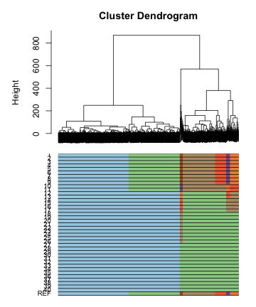

```
#> $mar
#> [1] 1 5 0 1
```


```r
plotStability(clustered_set)
```

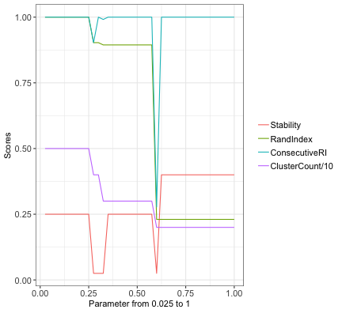

`plotDendrogram` generates a cluster-labelled dendrogram that also displays
the size of each cluster.


```r
plotDendrogram(clustered_set)
#> Warning in `labels<-.dendrogram`(dend, value = value, ...): The lengths
#> of the new labels is shorter than the number of leaves in the dendrogram -
#> labels are recycled.
```

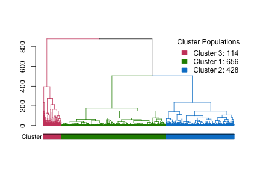

The clustering information can also be shown on plots as the information
has been added to colInfo.


```r
# Reduce dimensionality with t-SNE
clustered_set <- runTSNE(clustered_set, PCA = TRUE, 
                        dimensions = 2, seed = 1, 
                        perplexity = 30, theta = 0.5)
#> [1] "Running Rtsne..."
#> [1] "Rtsne complete! Returning matrix..."

# Generate a t-SNE plot
tsne_plot <- plotTSNE(clustered_set, Dim1 = 1, Dim2 = 2, group = "cluster")

# Generate a PCA plot
pca_plot <- plotPCA(clustered_set, PCX=1, PCY=2, group = "cluster")

# Generate MDS plot
mds_plot <- plotMDS(clustered_set, Dim1 = 1, Dim2 = 2, group = "cluster")
#> [1] "EMSet has undergone clustering. Retrieving distance matrix..."
#> [1] "Running cmdscale..."
#> [1] "Cmdscale complete! Processing scaled data..."
#> [1] "Generating MDS plot..."
```

```r
tsne_plot
```

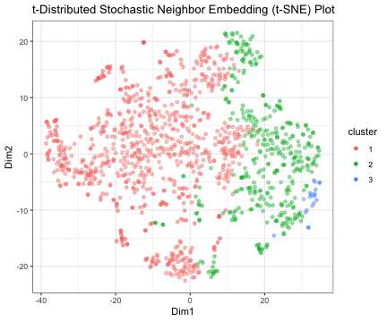


```r
pca_plot
```

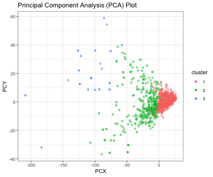


```r
mds_plot
```

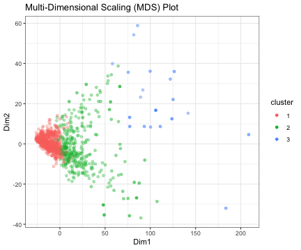

## 7. Differential expression
For differential expression analysis, `ascend` offers wrappers for the DESeq and 
DESeq2 packages. However, they are not suited for some datasets and systems.

Let's quickly review our dataset.

```r
col_info <- colInfo(clustered_set)
# Batch numbers
print("Cells per batch")
#> [1] "Cells per batch"
table(col_info$batch)
#> 
#>    1    2 
#> 1050  192

# Cluster numbers
print("Cells per cluster")
#> [1] "Cells per cluster"
table(col_info$cluster)
#> 
#>   1   2   3 
#> 839 383  20
```

This dataset is unbalanced as the two batches and three clusters
vary significantly in size. These are not accounted for in some models used for 
differential expression. 

We decided to implement a method described by McDavid, Finak, Chattopadyay et al.
2013 [https://academic.oup.com/bioinformatics/article-lookup/doi/10.1093/bioinformatics/bts714] that accounts for the bimodal nature of scRNA-seq
data for differential expression analysis in `ascend`. 

Firstly, genes are either on or off and can be represented as a
discrete model. Secondly, if genes are being expressed, it can be represented
with a continuous model. The discrete and continuous models are incorporated
into a combined Likelihood Ratio Test (LRT). Genes with no variance are assumed
to only have a discrete model.

This method performs analysis on a gene-gene basis and thus is not affected by
differences in sample sizes. However, as this method only studies gene-gene
differences, ....


```r
# Run combined LRT
cluster1_vs_others <- runDiffExpression(clustered_set, group = "cluster",
                                        condition.a = 1, condition.b = c(2, 3),
                                        subsampling = TRUE, ngenes = 1500)
#> [1] "Identifying genes to retain..."
#> [1] "Running LRT..."
#> [1] "LRT complete! Returning results..."
cluster2_vs_others <- runDiffExpression(clustered_set, group = "cluster",
                                        condition.a = 2, condition.b = c(1, 3),
                                        subsampling = TRUE, ngenes = 1500)
#> [1] "Identifying genes to retain..."
#> [1] "Running LRT..."
#> [1] "LRT complete! Returning results..."
cluster3_vs_others <- runDiffExpression(clustered_set, group = "cluster",
                                        condition.a = 3, condition.b = c(1, 2),
                                        subsampling = TRUE, ngenes = 1500)
#> [1] "Identifying genes to retain..."
#> [1] "Running LRT..."
#> [1] "LRT complete! Returning results..."
```


```r
# Generate volcano plots
cluster1_volcano <- plotVolcano(cluster1_vs_others, l2fc = 2, 
                                threshold = 5e-3, 
                                labels = TRUE,
                                label.size = 3,
                                check.overlap = TRUE)

cluster2_volcano <- plotVolcano(cluster2_vs_others, l2fc = 2, 
                                threshold = 5e-3, 
                                labels = TRUE,
                                label.size = 3,
                                check.overlap = TRUE)

cluster3_volcano <- plotVolcano(cluster3_vs_others, l2fc = 2, 
                                threshold = 5e-3, 
                                labels = TRUE,
                                label.size = 3,
                                check.overlap = TRUE)

library(ggplot2)
cluster1_volcano <- cluster1_volcano + ggtitle("Cluster 1 vs Cluster 2 and 3")
cluster2_volcano <- cluster2_volcano + ggtitle("Cluster 2 vs Cluster 1 and 3")
cluster3_volcano <- cluster3_volcano + ggtitle("Cluster 3 vs Cluster 1 and 2")
```


```r
cluster1_volcano
```

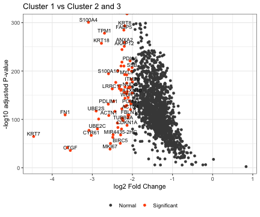


```r
cluster2_volcano
```

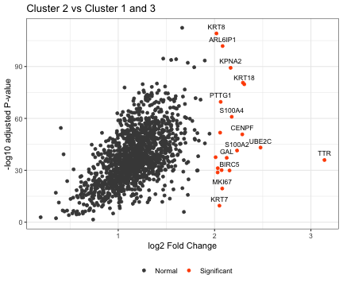


```r
cluster3_volcano
```

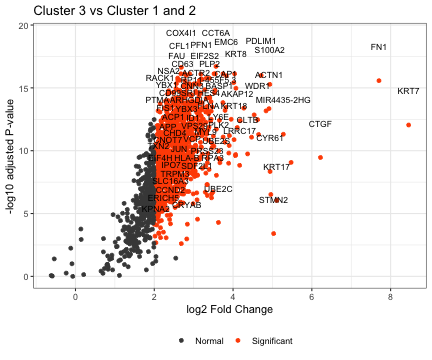

## 8. Branching out with other R packages
In this tutorial, we covered the main `ascend` workflow that completes the 
following the tasks:

1. Quality control
2. Filtering
3. Normalisation
4. Dimensionality reduction
5. Clustering
6. Differential expression

As the package focuses on so many steps, it does not cover the individual steps
in as great detail as other packages. Instead, we have chosen methods that are 
fast and effective. If you require more detailed analysis, you may export
the data stored in the EMSet for use with other packages.


```r
sce_object <- EMSet2SCE(clustered_set)

# Extract data from EMSet
# Expression matrix
count_matrix <- counts(clustered_set)
normalised_matrix <- normcounts(clustered_set)
log_matrix <- logcounts(clustered_set)
```

### Package wrappers
We have created wrappers for specific tasks in `scran`, `DESeq` and `DESeq2`.
They provide alternatives for specific stages in the `ascend` workflow and 
provide more in-depth analysis.

#### scran
##### scran normalisation by deconvolution

```r
scran_normalised <- scranNormalise(filtered_set, quickCluster = FALSE, min_mean = 1e-05)
#> [1] "1242 cells detected. Running computeSumFactors with preset sizes of 40, 60, 80, 100..."
#> [1] "scran's computeSumFactors complete. Adjusting zero sum factors..."
#> [1] "Running scater's normalize method..."
#> [1] "Normalisation complete. Converting SingleCellExperiment back to EMSet..."
```

### DESeq

```r
cluster1_vs_others <- runDESeq(clustered_set, group = "cluster",
                               condition.a = 1, condition.b = c(2, 3),
                               ngenes = 1500)
#> [1] "Identifying genes to retain..."
#> [1] "Running DESeq..."
#> [1] "DESeq complete! Adjusting results..."
```

### DESeq2
DESeq2 requires more time than allowed for this workshop, so we will not run it.

```r
cluster1_vs_others <- runDESeq2(clustered_set, group = "cluster",
                               condition.a = 1, condition.b = c(2, 3),
                               ngenes = 1500)
```
